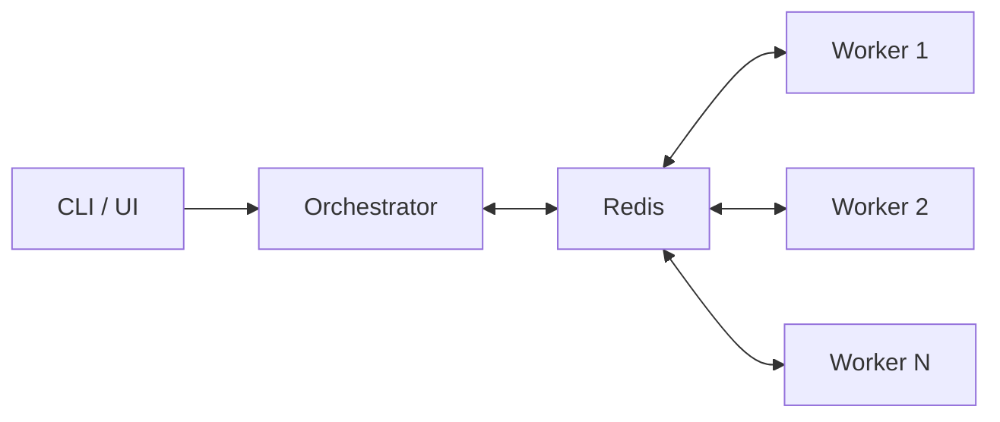
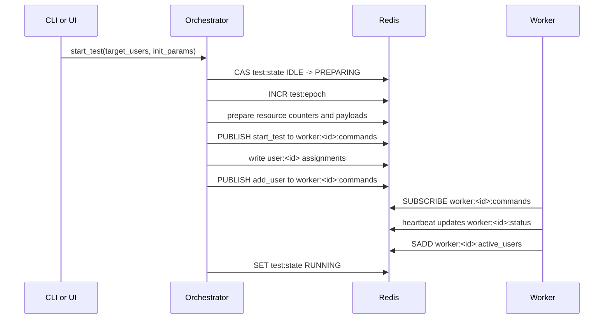
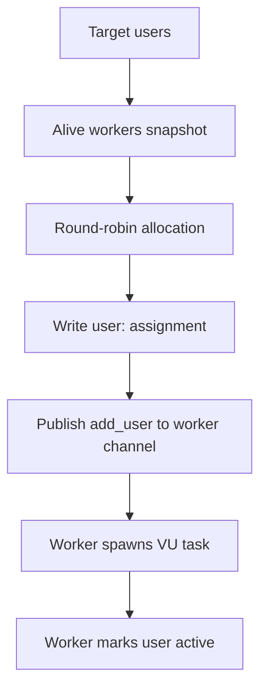

## Lifecycle

The runtime lifecycle is:

```text
IDLE -> PREPARING -> RUNNING -> STOPPING -> IDLE
```

What each state means:

- `IDLE`: no active test is running
- `PREPARING`: orchestrator validates startup conditions, bumps the epoch, prepares resources, and sends startup commands
- `RUNNING`: workers execute assigned virtual users
- `STOPPING`: orchestrator broadcasts stop commands and clears runtime state

## High-level flow



The orchestrator and workers do not talk to each other directly over custom sockets. Redis is the coordination layer between them.

## Start-test sequence



## Redis protocol between orchestrator and worker

There are three main communication patterns through Redis:

- command delivery through Pub/Sub
- shared runtime state through keys, hashes, and sets
- metrics and timeline events through Redis streams

## 1. Command delivery

The orchestrator sends commands to each worker through a dedicated Pub/Sub channel:

```text
worker:<worker_id>:commands
```

Workers subscribe to their own channel and decode each message as a `CommandEnvelope`.

Current command types:

- `start_test`
- `stop_test`
- `add_user`
- `remove_user`

Command envelope fields:

- `type`: command kind
- `command_id`: unique command identifier
- `epoch`: monotonic test epoch
- `sent_at`: Unix timestamp
- `payload`: command-specific JSON payload

Example shape:

```json
{
  "type": "add_user",
  "command_id": "8c6b7b0e-8f39-4f28-9d2c-61b50e0a6a40",
  "epoch": 3,
  "sent_at": 1773180000,
  "payload": {
    "user_id": 42
  }
}
```

## Why `epoch` exists

`epoch` protects workers from stale commands.

If a worker already moved to a newer test epoch, it ignores older `start_test`, `add_user`, `remove_user`, and `stop_test` messages. This prevents delayed Pub/Sub messages from a previous run from corrupting the current run.

## 2. Shared state in Redis

The orchestrator and workers also coordinate through stored Redis data.

Important keys:

- `test:state`: current lifecycle state
- `test:epoch`: current test epoch
- `workers`: set of registered workers
- `users`: set of assigned users
- `resources`: hash of declared resource counters

Worker-specific keys:

- `worker:<worker_id>:status`: heartbeat and health hash
- `worker:<worker_id>:users`: assigned users set
- `worker:<worker_id>:active_users`: currently running VUs set

User-specific keys:

- `user:<user_id>`: assigned worker, status, and update timestamp

Resource-specific keys:

- `resource:<name>:available`: available resource ids set
- `resource:<name>:pool_loaded_count`: local pool sync watermark
- `resource:<name>:<resource_id>`: resource payload

## Worker heartbeat protocol

Workers periodically publish their health into:

```text
worker:<worker_id>:status
```

This hash includes:

- `status`
- `last_heartbeat`
- `cpu_percent`
- `rss_bytes`
- `memory_percent`
- `total_ram_bytes`

The orchestrator uses this data to determine which workers are alive and eligible for orchestration decisions.

## 3. Metrics and timeline streams

Workers append runtime metrics to Redis streams:

```text
metric:<metric_id>
```

The orchestrator also writes a users timeline stream:

```text
users:timeline
```

Those streams are used for the UI and aggregated monitoring views.

## User assignment model

User placement is orchestrated centrally:

- orchestrator selects alive workers
- users are assigned round-robin across that worker snapshot
- assignment is stored in Redis before or alongside worker command delivery
- worker starts or stops VU tasks based on received commands



## Resource coordination

Resources are also synchronized through Redis rather than direct worker-to-worker coordination.

- orchestrator stores the total resource count in `resources`
- resource payloads are stored under `resource:<name>:<id>`
- workers lazily sync available ids into `resource:<name>:available`
- a worker acquires a resource with `SPOP`
- a worker releases a resource with `SADD`

This gives global uniqueness across the cluster as long as Redis remains the single coordination point.
